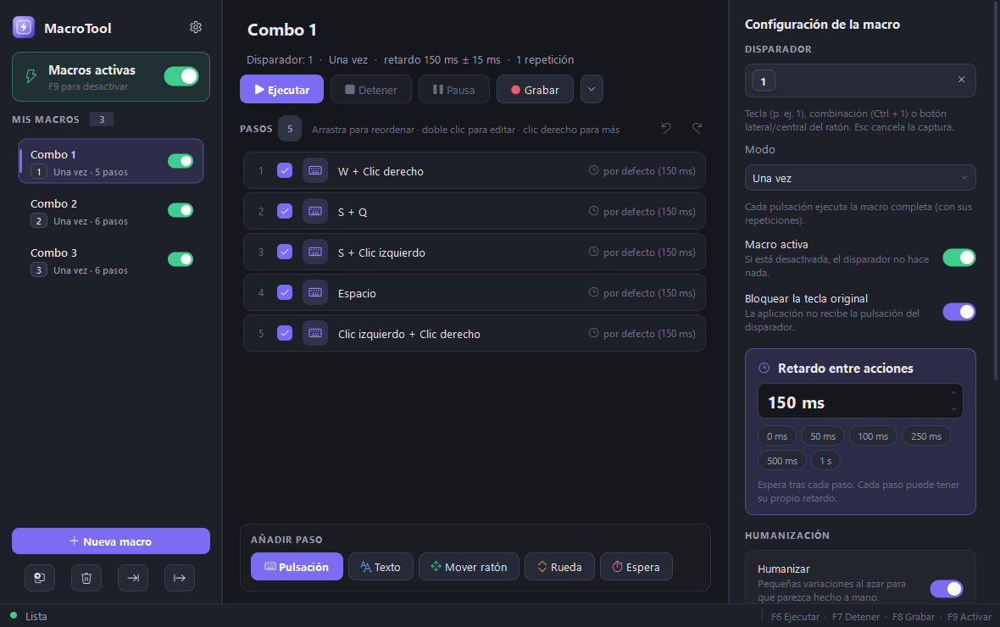
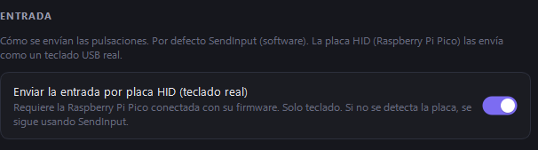

# MacroTool

Macros de teclado y ratón para Windows, con interfaz en español, pensada también para
**accesibilidad** (uso con una sola mano) y con una ruta de entrada por **HID real** para
pruebas fieles al hardware.



---

## Características

- 🎬 **Grabar y reproducir** secuencias de teclado y ratón (pulsaciones, texto, movimientos, rueda, esperas).
- ⌨️ **Disparadores** por tecla, combinación o botón del ratón, en tres modos: *una vez*, *alternar* y *mientras se mantiene*.
- 🧩 **Pasos editables**: pulsaciones/combos, escritura de texto, mover el ratón (absoluto o relativo), rueda y pausas.
- 🖐️ **Pensado para una mano**: combos, repeticiones y disparadores configurables para reducir el número de teclas necesarias.
- 🤖 **Humanización** opcional: pequeñas variaciones de tiempo para que la reproducción no sea robótica.
- 🎮 **Compatibilidad con juegos** vía scancodes (DirectInput).
- 🧷 **Atajos globales**, **bandeja del sistema** y **parada de emergencia** llevando el ratón a una esquina.
- 🔌 **Backend de HID real** (opcional): teclea a través de una placa (Raspberry Pi Pico) como **teclado USB auténtico**.

## Backend de entrada: SendInput vs. HID real

Por defecto, MacroTool inyecta la entrada con **`SendInput`** (software), que funciona en
prácticamente cualquier aplicación. Además, incluye un backend opcional que envía las
pulsaciones a una **Raspberry Pi Pico** por puerto serie; la placa las reproduce como un
**teclado USB real**, de modo que la entrada llega por la ruta de hardware genuina (sin el
flag "inyectado" que marca `SendInput`).

Esto es útil para **accesibilidad** en apps que ignoran la entrada inyectada, y para **QA**:
probar cómo tu propia aplicación percibe la entrada real frente a la sintética.

Se activa desde **Ajustes → Entrada**:



- **Interruptor desactivado** (por defecto): `SendInput`.
- **Activado**: usa la placa HID (autodetectada). Si no se detecta, sigue con `SendInput` y avisa.

Preparación de la placa: consulta [`firmware/README.md`](firmware/README.md).

## Herramientas de diagnóstico

- **`tools/input_inspector.py`** — muestra en vivo cómo una app ve cada evento en los cuatro
  canales que Windows usa para distinguir entrada real de inyectada (flag del hook de bajo
  nivel, `GetCurrentInputMessageSource`, `hDevice` de Raw Input y `dwExtraInfo`).
- **`tools/hid_demo.py`** — teclea una frase a través de la placa HID para comprobarla.

## Requisitos

- Windows 10/11 (x64)
- Python 3.11+
- Dependencias: `pip install -r requirements.txt`
  (incluye `PySide6` y `pyserial`; este último solo hace falta para el backend HID.)

## Uso (desde el código)

```bash
pip install -r requirements.txt
python main.py
```

O bien, con doble clic en `run.bat`.

## Descargar el ejecutable

En la sección **[Releases](https://github.com/joranro1997/MacroTool/releases)** encontrarás
`MacroTool.exe` (un solo fichero, sin necesidad de instalar Python).

## Compilar el .exe

```bash
pip install -r requirements.txt pyinstaller
build_exe.bat
```

Genera `dist/MacroTool.exe` a partir de `MacroTool.spec`.

## Tests

```bash
python -m pytest -q
```

## Estructura del proyecto

```
macrotool/
  model.py        # datos: pasos, macro y ajustes (serializables a JSON)
  engine.py       # reproductor de macros (hilo de trabajo, tiempos precisos)
  controller.py   # lógica de disparadores (una vez / alternar / mantener)
  winput.py       # backend SendInput + utilidades Win32 (InputBackend Protocol)
  hidserial.py    # backend de HID real por placa (solo teclado)
  keys.py         # tokens de teclas ↔ VK / scancodes / nombres
  hooks.py        # hooks globales de teclado/ratón
  recorder.py     # grabación de acciones a pasos
  storage.py      # persistencia (macros.json, settings.json)
  ui/             # interfaz PySide6
firmware/         # firmware CircuitPython para la Raspberry Pi Pico
tools/            # inspector de entrada, demo HID, generador de icono
tests/            # suite de pruebas (pytest)
```

## Licencia

Publicado bajo **[The Unlicense](LICENSE)** (dominio público): puedes usar, copiar,
modificar, distribuir y vender este software sin restricciones ni necesidad de atribución.
